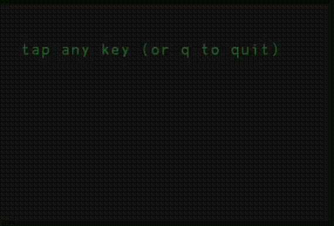

# tap
tempo on the command line

You tap and you get a BPM. Tap more, and you get BPM with different levels of smoothing

This is something I've needed, but also did this to learn how to make an interactive TUI with curses. 

No dependencies on mac or linux, just run `py tap.py`. On windows, you need to first install the `curses` package for python. 
